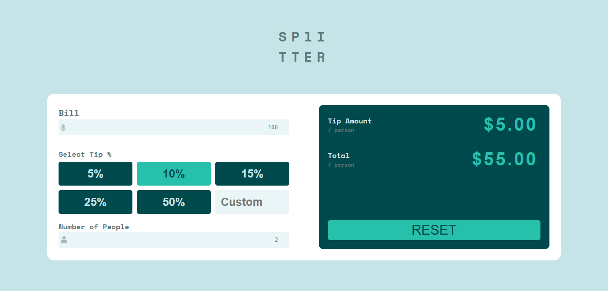

# Frontend Mentor - Tip calculator app

This is a solution to the [Tip calculator app](https://www.frontendmentor.io/challenges/tip-calculator-app-ugJNGbJUX). Frontend Mentor challenges help you improve your coding skills by building realistic projects.

## Table of contents

- [Overview](#overview)
  - [The challenge](#the-challenge)
  - [Screenshot](#screenshot)
  - [Links](#links)
  - [Installation](#Installation)
  - [Usage](#Usage)
- [My process](#my-process)
  - [Built with](#built-with)
  - [What I learned](#what-i-learned)
  - [Continued development](#continued-development)
- [Author](#author)
- [Acknowledgments](#Acknowledgments)

## Overview

### The challenge

This small app is perfect for anyone starting to get to grips with JavaScript. The calculator functionality will be a nice test!

Your users should be able to:

- Calculate the correct tip and total cost of the bill per person
- View the optimal layout for the app depending on their device's screen size
- See hover states for all interactive elements on the page

### Screenshot



### Links

- Solution URL: [here](https://github.com/olahasan/HTML_CSS_AND_j.s_Frontend-Mentor_JUNIOR-Tip-calculator-app)

- Live Site URL: [here](https://olahasan.github.io/HTML_CSS_AND_j.s_Frontend-Mentor_JUNIOR-Tip-calculator-app/)

## Installation

To get a local copy up and running, follow these simple steps:

1. **Clone the repository**:

   ```sh
   git clone https://github.com/your-username/your-repo-name.git
   ```

2. **Navigate to the project directory**:

   ```sh
   cd your-repo-name
   ```

3. **Open the project in your preferred code editor**.

## Usage

1. Enter the bill amount.
2. Select a tip percentage or enter a custom tip percentage.
3. Enter the number of people.
4. The app will automatically calculate and display the tip amount and total amount per person.

## My process

### Built with

- Semantic HTML5 markup
- CSS custom properties
- Flexbox
- CSS Grid
- Mobile-first workflow
- JavaScript

### What I Learned

In this project, I learned how to:

- Implement form validation using JavaScript.
- Real-time calculation of tip amount and total amount per person.
- Customizable tip percentage.
- Input validation for bill amount and number of people.
- Responsive design for different screen sizes.

### Continued Development

In future projects, I plan to:

Improve my skills in html, css and javascript

### Author

Frontend Mentor - @olahasan<br>
GitHub - @olahasan

### Acknowledgments

I would like to thank the **Frontend Mentor** for providing this challenge and to the community for their support and feedback
